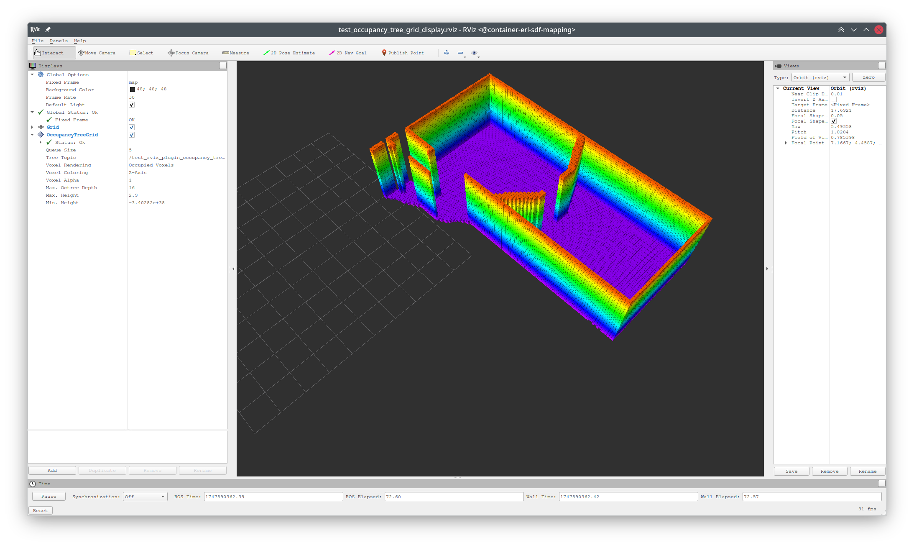

# Launch Files

- [test_occupancy_tree_grid_display.launch](test_occupancy_tree_grid_display.launch): Launches the
  occupancy tree grid display node to test the rviz plugin for visualizing occupancy quadtree/octree
  as grids.
  ```shell
  roslaunch erl_geometry test_occupancy_tree_grid_display.launch
  # arguments:
  # is_3d: true or false
  # is_double: true or false
  # publish_binary_msg: true or false
  ```
  
